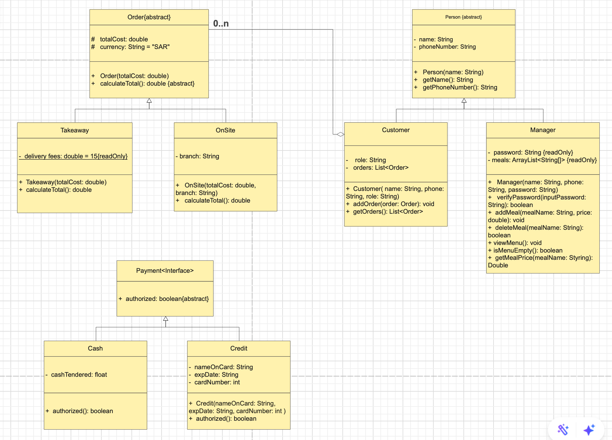

# Al Diwan Restaurant — Java OOP System

**Course:** CS311 - Object Oriented Programming  
**University:** Imam Abdulrahman Bin Faisal University  
**Language:** Java  
**IDE:** NetBeans

---

## Project Overview

A console-based restaurant management system built with Java, applying core OOP principles. The system supports two roles — Manager and Customer — handling menu management, order processing, and payment validation.

---

## UML Diagram



---

## Class Structure

```
Person (abstract)
├── Customer
└── Manager

Order (abstract)
├── OnSite
└── Takeaway

Payment (interface)
├── Cash
└── Credit
```

---

## Class Descriptions

### Person (Abstract)
Base abstract class for all system users. Defines shared attributes `name` and `phoneNumber` with getter methods. Ensures reusability and avoids code duplication across `Customer` and `Manager`.

### Customer
Extends `Person`. Represents a restaurant customer. Stores a list of orders using `ArrayList<Order>`. Provides `addOrder()` and `getOrders()` methods. An aggregation relationship exists between `Customer` and `Order`, allowing each customer to hold multiple orders.

### Manager
Extends `Person`. Represents the restaurant manager. Includes a read-only `password` attribute for secure access. Manages the menu through `addMeal()`, `deleteMeal()`, `viewMenu()`, `isMenuEmpty()`, and `getMealPrice()` methods. Only authorized users with the correct password can update the menu.

### Order (Abstract)
Abstract class representing a customer order. Contains `totalCost` (double) and `currency` (String, default "SAR"). Declares the abstract method `calculateTotal()` which subclasses must implement.

### OnSite
Extends `Order`. Handles in-restaurant dining orders. Includes a `branch` attribute. Overrides `calculateTotal()` to return the total cost without additional fees.

### Takeaway
Extends `Order`. Handles delivery orders. Includes a fixed delivery fee of 15 SAR. Overrides `calculateTotal()` to return `totalCost + deliveryFees`.

### Payment (Interface)
Interface defining the `authorized()` method. Implemented by `Cash` and `Credit` to handle different payment types.

### Cash
Implements `Payment`. Represents cash transactions. The `authorized()` method always returns `true` since cash is always accepted.

### Credit
Implements `Payment`. Represents credit card transactions. Contains `nameOnCard`, `expDate`, and `cardNumber` attributes. The `authorized()` method validates the card by checking whether the expiry date is after the current date using `SimpleDateFormat`. Includes a try-catch block to handle invalid date formats gracefully.

---

## OOP Concepts Applied

| Concept | Application |
|---------|-------------|
| Abstraction | `Person` and `Order` are abstract classes; `Payment` is an interface |
| Inheritance | `Customer` and `Manager` extend `Person`; `OnSite` and `Takeaway` extend `Order`; `Cash` and `Credit` implement `Payment` |
| Encapsulation | Private attributes like `password`, `meals`, and `orders` are accessed through public methods |
| Polymorphism | `calculateTotal()` overridden in `OnSite` and `Takeaway`; `authorized()` overridden in `Cash` and `Credit` |

---

## Features

**Manager**
- Password-protected login (`mng22`)
- Add meals with name and price
- Delete meals by name
- View full menu

**Customer**
- View available menu
- Select multiple meals and calculate total
- Choose order type: OnSite or Takeaway (delivery fee: 15 SAR)
- Pay by Cash or Credit Card
- Credit card expiry date validation

---

## How to Run

1. Open the project in [NetBeans](https://netbeans.apache.org/)
2. Build and run `AlDiwanRestaurant.java`
3. Follow the console prompts
4. Manager password: `mng22`
5. Credit card date format: `dd-MM-yyyy`

---

## Files

| File | Description |
|------|-------------|
| `AlDiwanRestaurant.java` | Main class and entry point |
| `Person.java` | Abstract base class for all users |
| `Customer.java` | Customer role with order management |
| `Manager.java` | Manager role with menu control |
| `Order.java` | Abstract order class containing OnSite and Takeaway subclasses |
| `Payment.java` | Payment interface |
| `Cash.java` | Cash payment — always authorized |
| `Credit.java` | Credit card payment with expiry date validation |

---

## Author

**Razan Alqahtani**  
Computer Science Student — IAU
